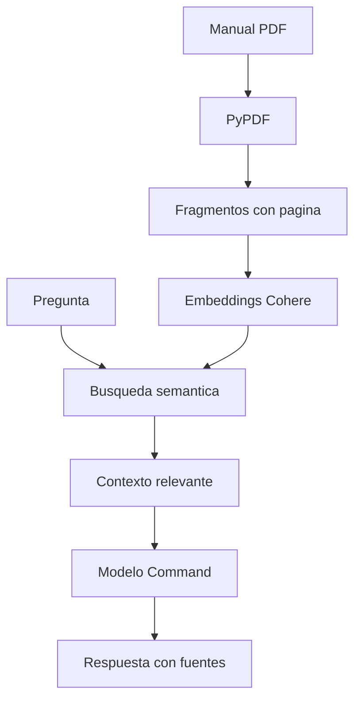

# Asistente Interno de TI ADD

Asistente inteligente orientado al equipo de soporte TI que responde preguntas en lenguaje natural usando como unica fuente el documento Procedimientos y Guias de Soporte TI de Distribuidora ADD. El proyecto fue desarrollado para el Challenge Alura Agente del programa ONE AI for Tech LATAM G10.

> Estado: primera version funcional. La evidencia y la URL publica de OCI se agregaran despues del despliegue.

## Problema

En una importadora y distribuidora, el equipo de soporte TI suele perder tiempo buscando procedimientos internos entre correos, chats, tickets viejos o documentos extensos. Este asistente centraliza consultas sobre contraseñas, tickets, accesos, VPN, SGI, facturacion, software, seguridad, administracion basica de Windows y guias rapidas de soporte TI, sin recorrer el PDF manualmente.

El publico principal de la solucion es el Area de TI. Los procedimientos orientados a usuarios finales tambien se incluyen porque sirven como material de consulta para soporte al momento de guiar o responder solicitudes.

## Arquitectura



1. PyPDF extrae el texto del manual y conserva el numero de pagina.
2. El contenido se divide en fragmentos parcialmente superpuestos.
3. Cohere Embed convierte los fragmentos y la pregunta en vectores.
4. Una busqueda por similitud coseno recupera los cuatro fragmentos mas relevantes.
5. Cohere Command genera una respuesta limitada al contexto recuperado.
6. Streamlit presenta la conversacion y permite revisar las fuentes utilizadas por el equipo de soporte.

## Tecnologias

- Python 3.12
- Streamlit
- Cohere API v2: Embed y Chat
- PyPDF
- NumPy
- Docker
- Oracle Cloud Infrastructure Compute

## Estructura

```text
.
├── app.py
├── data/
│   └── procedimientos_y_guias_soporte_ti_distribuidora_add.pdf
├── scripts/
│   └── generate_manual.py
├── src/
│   ├── agent.py
│   ├── document_loader.py
│   ├── models.py
│   └── retriever.py
├── tests/
├── Dockerfile
├── requirements.txt
└── .env.example
```

## Ejecucion local

### Requisitos

- Python 3.12 o superior
- Una API key de Cohere

### Instalacion

```bash
git clone URL_DEL_REPOSITORIO
cd alura-agente-soporte-ti
python -m venv .venv
source .venv/bin/activate
pip install -r requirements.txt
cp .env.example .env
```

En Windows, la activacion del entorno virtual se realiza con:

```powershell
.venv\Scripts\activate
```

Edita `.env` y agrega la API key:

```env
COHERE_API_KEY=tu_api_key
```

No publiques el archivo `.env`: ya esta excluido mediante `.gitignore`.

Inicia la aplicacion:

```bash
streamlit run app.py
```

Luego abre `http://localhost:8501`.

## Ejecucion con Docker

```bash
docker build -t agente-soporte-ti .
docker run --rm -p 8501:8501 --env-file .env agente-soporte-ti
```

## Preguntas y respuestas

**Pregunta:** Un usuario olvido su contraseña del correo. ¿Que corresponde hacer?

**Respuesta esperada:** Debes abrir un ticket en la plataforma interna de TI e indicar nombre del usuario, area, problema detectado y un medio alternativo de contacto. El restablecimiento no se gestiona por WhatsApp ni por pedido verbal. [pagina 3]

**Pregunta:** ¿En cuanto tiempo atienden un incidente critico?

**Respuesta esperada:** Un incidente P1 tiene un objetivo de primera respuesta de 15 minutos y recibe actualizaciones cada 30 minutos. [pagina 3]

**Pregunta:** Un usuario olvido su contraseña del SGI. ¿Que debe indicarle soporte?

**Respuesta esperada:** Debes ingresar a la pantalla de acceso de SGI y seleccionar la opcion Olvide mi contrasena. El sistema enviara automaticamente por correo una contrasena temporal y, al ingresar con ella, te pedira definir una nueva contrasena. [pagina 4]

**Pregunta:** ¿Que revisar si un usuario no abre su carpeta compartida?

**Respuesta esperada:** Si esta fuera de la empresa, primero se debe verificar que este conectado a la VPN. Si esta dentro, se debe validar que tenga conexion a Internet y luego revisar la configuracion DNS de la interfaz activa. La direccion primaria debe ser 192.0.2.4 y la secundaria 198.51.100.136 o 203.0.113.8. [pagina 10]

**Pregunta:** ¿Que revisar si no funciona una impresora?

**Respuesta esperada:** Se debe verificar la IP de la impresora en el archivo Excel de la compartida de Informatica y probar conectividad con ping. Si responde, se puede desinstalar la impresora del equipo del usuario y volver a instalarla con los drivers organizados por impresora en la compartida. [pagina 10]

**Pregunta:** ¿Como verifico el numero de serie de una notebook?

**Respuesta esperada:** Desde PowerShell se debe ejecutar el comando Get-WmiObject win32_bios | Select-Object SerialNumber. El resultado se utiliza para inventario, garantia o validacion del equipo. [pagina 10]

**Pregunta:** ¿Como conectarse a Exchange Online desde PowerShell?

**Respuesta esperada:** Se debe permitir la ejecucion solo para esa sesion, forzar TLS 1.2, importar el modulo ExchangeOnlineManagement y luego ejecutar Connect-ExchangeOnline con una cuenta de soporte de ejemplo y la opcion DisableWAM. [pagina 10]

**Pregunta:** Un usuario consulta si puede instalar la VPN en su computadora personal. ¿Que debe responder soporte?

**Respuesta esperada:** No. La VPN corporativa solo puede utilizarse desde equipos administrados por Distribuidora ADD. [pagina 7]

**Pregunta fuera del documento:** ¿Cual es la clave del Wi-Fi de visitantes?

**Respuesta esperada:** Esa informacion no se encuentra documentada en el manual proporcionado.

## Pruebas

```bash
pip install -r requirements-dev.txt
pytest
```

## Seguridad

- La API key se carga desde una variable de entorno y no se incluye en Git.
- El prompt obliga al agente a reconocer cuando la respuesta no esta documentada.
- Las fuentes recuperadas se muestran para facilitar la verificacion.
- El manual es ficticio y no contiene datos internos ni credenciales reales.
- Las URLs, correos, telefonos e IPs del manual fueron reemplazados por valores ficticios de ejemplo para evitar exponer infraestructura real.

## Despliegue en OCI

La aplicacion esta preparada para ejecutarse en una instancia de OCI Compute mediante Docker. Para publicarla se debe clonar el repositorio en la instancia, crear el archivo `.env`, construir la imagen y habilitar el puerto TCP 8501 en el Network Security Group y en el firewall del sistema operativo.

**URL publica:** pendiente de despliegue.

**Evidencia:** pendiente de despliegue.

## Autor

Paulo Renato Preda - Challenge Alura Agente, 2026.
