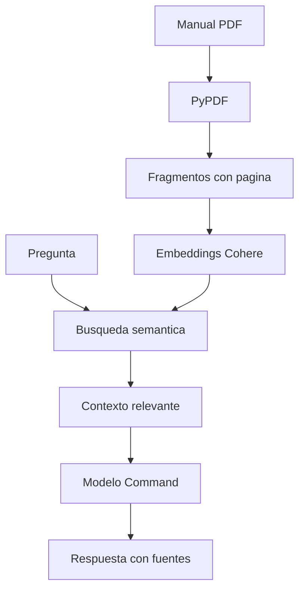

# Asistente Interno de TI ADD

Asistente inteligente orientado exclusivamente al equipo de soporte TI que responde preguntas en lenguaje natural usando como fuente de conocimiento procedimientos internos creados especificamente para Distribuidora ADD. El proyecto fue desarrollado para el Challenge Alura Agente del programa ONE AI for Tech LATAM G10.

> Estado: primera version funcional. La evidencia y la URL publica de OCI se agregaran despues del despliegue.

## Problema

En una importadora y distribuidora, el equipo de soporte TI suele recibir casos repetidos por chat, correo o ticket: un usuario no abre su carpeta compartida, no funciona una impresora, alguien olvido la contraseña del correo o no puede ingresar al SGI. Buscar los pasos correctos entre documentos extensos o mensajes viejos consume tiempo y genera respuestas inconsistentes.

Este asistente centraliza ese conocimiento en una sola interfaz para que el analista de TI describa el caso y obtenga los pasos operativos documentados. El publico de la solucion es el Area de TI; no esta pensada como herramienta de autoservicio para usuarios finales.

## Objetivo de la IA

La IA fue pensada como apoyo interno para el trabajo diario del Area de TI de ADD. Su funcion no es atender directamente a usuarios finales, sino ayudar al personal de soporte cuando aparece un caso operativo concreto.

Ejemplos de uso:

- un usuario no puede conectarse por VPN
- una impresora dejo de funcionar
- alguien olvido la contraseña del correo
- un equipo necesita validacion de numero de serie
- soporte necesita recordar los pasos de un procedimiento administrativo o tecnico

La base documental fue armada con procedimientos adaptados al contexto de ADD y separados en dos grupos:

- casos operativos de soporte a usuarios
- herramientas y tareas administrativas del Area de TI

## Arquitectura



1. PyPDF extrae el texto de los documentos base y conserva el numero de pagina.
2. El contenido se divide en fragmentos parcialmente superpuestos.
3. Cohere Embed convierte los fragmentos y la pregunta en vectores.
4. Una busqueda por similitud coseno recupera los fragmentos mas relevantes entre todos los PDFs cargados.
5. Cohere Command genera una respuesta limitada al contexto recuperado.
6. Streamlit presenta la conversacion, permite cargar PDFs adicionales y muestra las fuentes utilizadas por soporte.

## Tecnologias

- Python 3.12
- Streamlit
- Cohere API v2: Embed y Chat
- PyPDF
- NumPy
- Docker
- Oracle Cloud Infrastructure Compute

## Estructura

```text
.
├── app.py
├── assets/
├── data/
│   ├── casos_operativos_soporte_ti_add.pdf
│   ├── herramientas_y_administracion_ti_add.pdf
│   └── uploads/
├── scripts/
│   └── generate_manual.py
├── src/
│   ├── agent.py
│   ├── document_loader.py
│   ├── models.py
│   └── retriever.py
├── tests/
├── Dockerfile
├── requirements.txt
└── .env.example
```

## Ejecucion local

### Requisitos

- Python 3.12 o superior
- Una API key de Cohere

### Instalacion en Linux o macOS

```bash
git clone https://github.com/Tatombore1/asistente-interno-ti-add.git
cd asistente-interno-ti-add
python3.12 -m venv .venv
source .venv/bin/activate
python -m pip install --upgrade pip
python -m pip install -r requirements.txt
cp .env.example .env
```

### Instalacion en Windows

```powershell
git clone https://github.com/Tatombore1/asistente-interno-ti-add.git
cd asistente-interno-ti-add
py -3.12 -m venv .venv
.venv\Scripts\activate
python -m pip install --upgrade pip
python -m pip install -r requirements.txt
copy .env.example .env
```

Edita `.env` y agrega la API key:

```env
COHERE_API_KEY=tu_api_key
```

No publiques el archivo `.env`: ya esta excluido mediante `.gitignore`.

### Verificacion rapida del entorno

Una vez activado el entorno virtual, conviene validar que la otra PC este usando el Python correcto:

```bash
python --version
which python
```

En Windows se puede usar:

```powershell
python --version
where python
```

La ruta debe apuntar al entorno virtual del proyecto, por ejemplo `.venv/bin/python` o `.venv\Scripts\python.exe`.

### Inicio de la aplicacion

Inicia la aplicacion con el Python del entorno virtual:

```bash
python -m streamlit run app.py
```

Luego abre `http://localhost:8501`.

## Base documental

La aplicacion consulta de forma conjunta todos los documentos disponibles en la base:

- `data/casos_operativos_soporte_ti_add.pdf`
- `data/herramientas_y_administracion_ti_add.pdf`
- cualquier PDF adicional cargado desde la web en `data/uploads/`

Desde la sidebar se pueden:

- descargar los dos documentos principales
- subir nuevos PDFs para ampliar la base
- reemplazar archivos existentes si se sube otro con el mismo nombre
- eliminar PDFs extra cargados manualmente

## Ejecucion con Docker

```bash
docker build -t agente-soporte-ti .
docker run --rm -p 8501:8501 --env-file .env agente-soporte-ti
```

## Preguntas y respuestas

**Pregunta:** Un usuario se olvido su contraseña del correo. ¿Cuales son los pasos?

**Respuesta esperada:** Soporte debe validar que exista una solicitud formal o ticket, restablecer la contraseña desde la consola administrativa, asignar una contraseña temporal y marcar que el usuario debe cambiarla en el siguiente inicio de sesion. Luego se responde el ticket con la contraseña temporal. [pagina 4]

**Pregunta:** ¿Como verifico el numero de serie de una notebook?

**Respuesta esperada:** Desde PowerShell se debe ejecutar el comando `Get-WmiObject win32_bios | Select-Object SerialNumber`. El resultado se utiliza para inventario, garantia o validacion del equipo. [pagina 3 del documento de herramientas]

**Pregunta:** Un usuario no puede conectarse por VPN. ¿Que pasos sigo?

**Respuesta esperada:** Primero se debe validar Internet, fecha y hora del equipo y reiniciar Sophos Connect. Si persiste, registrar el codigo de error, confirmar que el usuario utilice correctamente sus credenciales de dominio y, si hace falta, reprovisionar la configuracion VPN. [pagina 6]

**Pregunta fuera del documento:** ¿Cual es la clave del Wi-Fi de visitantes?

**Respuesta esperada:** Esa informacion no se encuentra documentada en los documentos cargados.

## Pruebas

```bash
python -m pip install -r requirements-dev.txt
python -m pytest
```

Estas pruebas deben ejecutarse dentro del entorno virtual activado.

## Seguridad

- La API key se carga desde una variable de entorno y no se incluye en Git.
- El prompt obliga al agente a reconocer cuando la respuesta no esta documentada.
- Las fuentes recuperadas se muestran para facilitar la verificacion.
- Los documentos son ficticios y no contienen datos internos ni credenciales reales.
- Las URLs, correos, telefonos e IPs fueron reemplazados por valores ficticios de ejemplo para evitar exponer infraestructura real.

## Despliegue en OCI

La aplicacion esta preparada para ejecutarse en una instancia de OCI Compute mediante Docker. Para publicarla se debe clonar el repositorio en la instancia, crear el archivo `.env`, construir la imagen y habilitar el puerto TCP 8501 en el Network Security Group y en el firewall del sistema operativo.

**URL publica:** pendiente de despliegue.

**Evidencia:** pendiente de despliegue.

## Autor

Paulo Renato Preda - Challenge Alura Agente, 2026.
